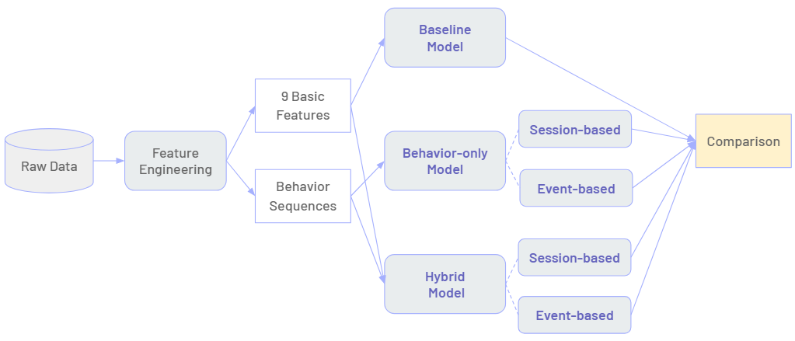

# Customer-Value-Prediction :dart:
My master thesis in NTU.

## Abstract
Propose <ins>**2 preprocessing methods of behavior data**</ins> + <ins>**5 experimental model**</ins>

:white_check_mark: Confirm if using the customer online behavior data could improve the most valuable customers’ model performance

:white_check_mark: Find the best model of the most valuable customers prediction

:white_check_mark: Explore the influence of customer online behaviors on customer value 

## Workflow

## Conclusion
1. Best model framework: Event-based Behavior-only Model
2. The more active the customer, the more important he or she is. 
3. Behaviors impacts on P (VIP)
    - Positive :thumbsup:: Search, Register, View sales page, Add to cart, Checkout, Purchase
    - Negative :thumbsdown:: Traffic source records, View main page

## DOC
[Oral Defence Slide](https://drive.google.com/file/d/1vPovYBmIKkV8sY89jAkGNojobZ8je5cR/view?usp=sharing)